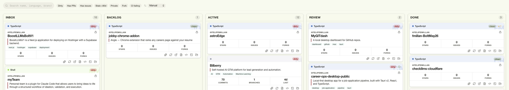

# MyGITdash

A local-first desktop dashboard for your Git repositories — a Kanban board of
your local repos, enriched with GitHub data and **on-device AI summaries** powered
by Apple Intelligence. Everything runs on your machine; nothing about your code
leaves it.



## What it is

MyGITdash scans a folder of Git repositories and lays them out as cards on a
five-column Kanban board (Inbox · Backlog · Active · Review · Done). Each card is
an information-dashboard: language, sync state, stats, and an AI-generated summary
+ tags — so you can read a project at a glance without opening it.

## Features

- **Editorial repo cards** — language-tinted header, branch sync glance
  (dirty / ahead / behind / CI), and an adaptive stat grid: stars / issues / forks
  for GitHub repos, or commits / branches / last-commit age for local-only repos.
- **On-device AI analysis** — Apple's FoundationModels LLM generates a one-line
  summary and topic tags per repo, on your machine, with no network calls and no
  API keys. Runs automatically on scan; degrades gracefully when unavailable.
- **GitHub enrichment** — stars, forks, open issues, PRs, CI status, latest
  release, topics, license, and more, cached locally and auto-refreshed.
- **Local Git status** — current branch, dirty/clean, ahead/behind upstream,
  read-only (no mutations).
- **Kanban workflow** — drag repos between columns; per-repo notes timeline
  stored alongside the repo.
- **Quick actions** — open in editor, terminal, Finder, or on GitHub.

## Requirements

- **macOS 26 (Tahoe) or later** on **Apple Silicon** — required for the on-device
  AI feature. On Intel Macs or with Apple Intelligence disabled, the app works
  fully; only the AI summaries are skipped (a one-time banner explains why).
- **Apple Intelligence enabled** (System Settings › Apple Intelligence) for AI
  summaries.
- A GitHub Personal Access Token (optional) for GitHub enrichment. It is stored in
  the macOS Keychain, never on disk.

## Privacy

- **AI is 100% on-device.** Repo context (README excerpt, languages, recent commit
  subjects, top-level file names) is sent only to Apple's local FoundationModels —
  never to a server.
- **GitHub token** lives in the macOS Keychain (service `repo_dashboard`).
- **App state** is a single local JSON file at `~/.repo_dashboard_state.json`.

## Build from source

> Not yet code-signed or notarized, so there is no downloadable installer yet —
> build it yourself. See [Distribution status](#distribution-status) below.

**Prerequisites**

- [Node.js](https://nodejs.org/) 20+ and npm
- [Rust](https://rustup.rs/) (stable) + the Tauri 2 prerequisites
- **Xcode 26** (for the Swift AI sidecar; macOS 26 SDK with FoundationModels)

**Steps**

```bash
# 1. Install JS dependencies
npm install

# 2. Build the on-device AI sidecar (Swift) and place it for Tauri
./scripts/build-ai-sidecar.sh

# 3. Run in development
npm run tauri dev

# …or build a release bundle
npm run tauri build
```

On first launch, pick a root folder to scan and (optionally) add a GitHub token in
Settings.

## How the AI works

A small standalone Swift binary, `mygitdash-ai` (in [`ai-sidecar/`](ai-sidecar/)),
reads a JSON repo-context on stdin and returns `{ summary, tags }` on stdout using
`LanguageModelSession` + `@Generable` structured output. The Rust backend
(`ai_analyze`) spawns it; a serial, content-hash-cached queue in the store runs it
over each repo after a scan and writes the result to the card. The context is
capped to stay within the model's 4096-token window.

The sidecar binary is **not** committed — `scripts/build-ai-sidecar.sh` builds it.

## Tech stack

Tauri 2 (Rust) · React 19 + TypeScript · Zustand · Tailwind CSS 4 ·
Apple FoundationModels (Swift) · vitest.

## Distribution status

The app is fully functional but **not yet signed or notarized**, so distributing a
prebuilt `.dmg` would be blocked by Gatekeeper on other Macs. A signed release
(Apple Developer ID + notarization, including the sidecar) is planned. For now,
build from source.

## Roadmap

- Semantic search across repos (Apple NaturalLanguage `NLContextualEmbedding`)
- Repo relationships from AI tags + embeddings
- A statistics view aggregating AI-derived insights
- Signed, notarized release

## License

[MIT](LICENSE) © 2026 Felipe Millán Assler
